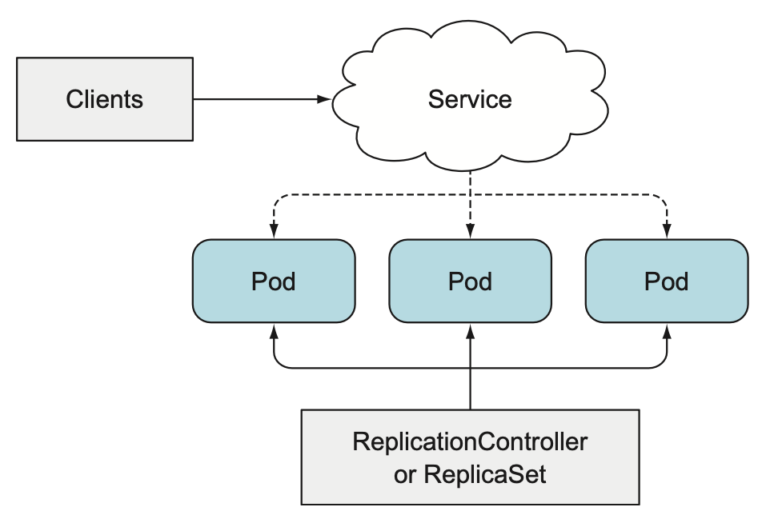
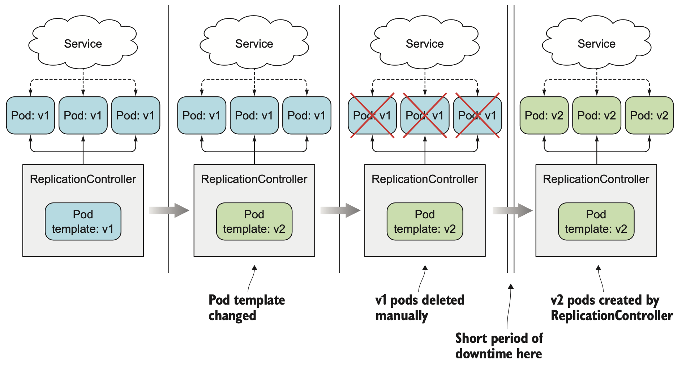
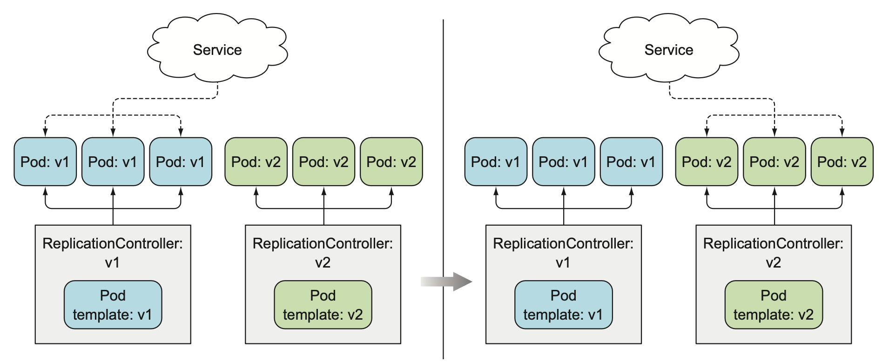

# 디플로이먼트: 선언적 애플리케이션 업데이트
쿠버네티스는 레플리카셋 기능을 활용하는 디플로이먼트 리소스를 제공해 선언적인 애플리케이션 업데이트를 가능하게 한다.

## 파드에서 실행 중인 애플리케이션 업데이트

- 처음에는 파드가 애플리케이션의 첫 번째 버전을 실행한다.
- 이미지에 v1 태그가 지정되어 있다고 가정
- 최신 버전을 개발해 v2 태그로 지정된 새 이미지를 이미지 저장소에 푸시한다.
- 다음으로 모든 파드를 이 새 버전으로 바꾸려고 한다. 파드를 만든 후에는 기존 파드의 이미지를 변경할 수 없으므로 기존 파드를 제거하고 새 이미지를 실행하는 새 파드로 교체해야 한다.
- 모든 파드를 업데이트하는 방법에는 두 가지가 있다.
  - 기존 파드를 모두 삭제한 다음 새 파드를 시작한다.
  - 새로운 파드를 시작하고, 기동하면 기존 파드를 삭제한다. 새 파드를 모두 추가한 다음 한꺼번에 기존 파드를 삭제하거나 순차적으로 새 파드를 추가하고 기존 파드를 점진적으로 제거해 이 작업을 수행할 수 있다.

두 가지 방법 중 첫 번째 방법은 다운타임이 존재해 해당 시간동안 애플리케이션을 사용할 수 없다.
두 번째 방법은 두 가지 버전이 동시에 실행되기 때문에 동작 중이던 기존 버전의 애플리케이션이 데이터 저장소에 데이터를 저장하는 동안 새로운 버전의 애플리케이션이 데이터 스키마 혹은 데이터 자체를 수정할 경우 충돌이 야기될 수 있다.

### 오래된 파드를 삭제하고 새 파드로 교체
v1 파드 셋을 관리하는 ReplicationController가 있는 경우 이미지의 v2 버전을 참조하도록 파드 템플릿을 수정한 다음 이전 파드 인스턴스를 삭제해 쉽게 교체할 수 있다. ReplicationController는 레이블 셀렉터와 일치하는 파드가 없다면 새 인스턴스를 시작한다.

이전 파드가 삭제되고 새 파드가 시작되는 동안 짧은 시간의 다운타임을 허용할 수 있다면 이는 파드 셋을 업데이트하는 가장 간단한 방법이다.

### 새 파드 기동과 이전 파드 삭제
다운타임이 발생하지 않고 한 번에 여러 버전의 애플리케이션이 실행하는 것을 지원하는 경우 프로세스를 먼저 전환해 새 파드를 모두 기동한 후 이전 파드를 삭제할 수 있다. 잠시 동안 동시에 두 배의 파드가 실행되므로 더 많은 하드웨어 리소스가 필요하다.

<한 번에 이전 버전에서 새 버전으로 전환>
파드의 앞쪽에는 일반적으로 서비스를 배치한다. 새 버전을 실행하는 파드를 불러오는 동안 서비스는 파드의 이전 버전에 연결된다. 그 다음 새 파드가 모두 실행되면 서비스의 레이블 셀렉터를 변경하고 서비스를 새 파드로 전환할 수 있다. 이것을 Blue-Green Deployment 라고 한다. 전환한 후 새 버전이 올바르게 작동하면 이전 ReplicationController를 삭제해 이전 파드를 삭제할 수 있다.

<롤링 업데이트 수행>