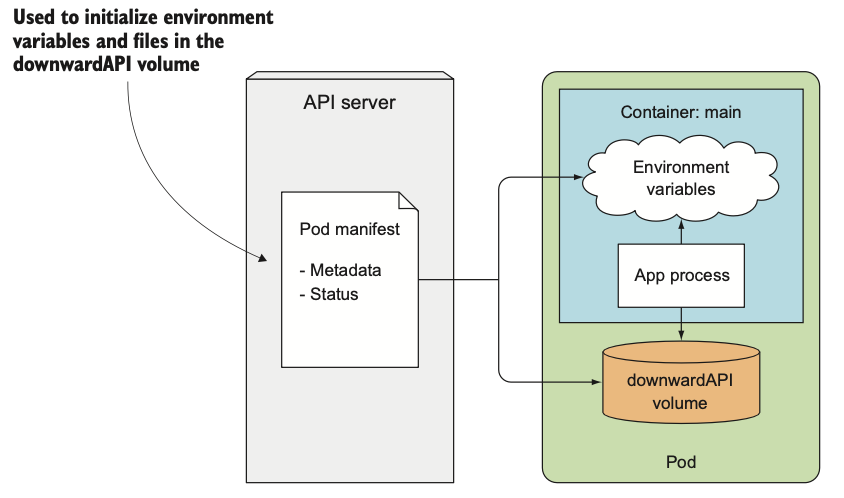

# 애플리케이션에서 파드 메타데이터와 그 외의 리소스에 액세스하기

## Downward API로 메타데이터 전달
- 환경변수 또는 컨피그맵과 시크릿 볼륨으로 설정 데이터를 애플리케이션에 전달하는 방법은 사용자가 데이터를 직접 설정하거나 파드가 노드에 스케줄링되어 실행되기 이전에 이미 알고 있는 데이터에 적합하다.
- 파드의 IP, 호스트 노드 이름 또는 파드 자체의 이름과 같이 실행 시점까지 알려지지 않은 데이터의 경우 환경변수 또는 Downward API 파일로 해결할 수 있다.
- Downward API는 이름과 달리 애플리케이션이 호출해서 데이터를 가져오는 REST 엔드포인트와는 다르다.

### 사용 가능한 메타데이터 이해
Downward API를 사용하면 파드 자체의 메타데이터를 해당 파드 내에서 실행 중인 프로세스에 노출할 수 있다. 현재 다음 정보를 컨테이너에 전달할 수 있다.
- 파드의 이름
- 파드의 IP 주소
- 파드가 속한 네임스페이스
- 파드가 실행 중인 노드의 이름
- 파드가 실행 중인 서비스 어카운트 이름
- 각 컨테이너의 CPU와 메모리 요청
- 각 컨테이너의 CPU와 메모리 제한
- 파드의 레이블
- 파드의 어노테이션

