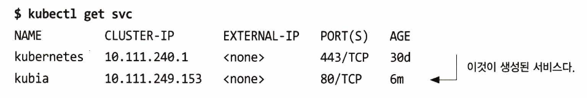

# 서비스: 클라이언트가 파드를 검색하고 통신을 가능하게 함

## 서비스의 필요성
- 파드는 일시적이다.
  - 다른 파드를 위한 공간 확보를 위해 제거되거나,
  - 누군가 파드 수를 줄이거나,
  - 클러스터 노드의 장애로 다른 노드로 이동될 수 있다.
- 클라이언트가 서버인 파드의 IP 주소를 미리 알 수 없다.
  - 노드에 파드를 스케줄링한 후 파드가 시작되기 전에 파드의 IP 주소를 할당하기 때문에 IP 주소를 미리 알 수 없다.
- 수평 스케일링은 여러 파드가 동일한 서비스를 제공할 수 있음을 의미한다.
  - 클라이언트는 서비스를 지원하는 파드의 수와 IP를 상관하지 않아야 한다.
  - 따라서 클라이언트가 파드의 개별 IP 목록을 유지할 필요가 없다.
  - 즉, 모든 파드가 동일한 IP 주소로 접근할 수 있어야 한다.

## 서비스 소개
- 동일한 서비스를 제공하는 파드 그룹에 지속적인 단일 접점을 만들 때 생성하는 리소스
- 각 서비스는 서비스가 **존재하는 동안 IP 주소와 포트가 절대 바뀌지 않음**
- 클라이언트는 서비스의 IP 주소와 포트로 접속한 다음 해당 서비스의 파드 중 하나로 연결됨
- 클라이언트가 개별 파드의 위치를 알 필요가 없기 때문에, 파드는 언제든지 클러스터 안에서 이동할 수 있음

## 서비스 생성

### kubectl expose로 서비스 생성

### yaml 디스크립터를 통한 서비스 생성
``` kubia-svc.yaml
apiVersion: v1
kind: Service
metadata:
  name: kubia
spec:
  ports:
  - port: 80
    targetPort: 8080
  selector:
    app: kubia
```
- kubia 라는 서비스를 정의
- 서비스가 사용할 포트는 80
- 서비스가 컨테이너로 포워드할 포트는 8080
- app=kubia 레이블이 있는 모든 파드가 서비스에 포함
- 이 후 kubectl create을 통해 서비스 생성

### 새 서비스 검사하기
$ kubectl get svc


- 서비스에 할당된 IP 주소는 10.111.249.153
- CLUSTER-IP이기 때문에 클러스터 내부에서만 접근 가능
- 서비스의 기본 목적은 파드 그룹을 클러스터의 다른 파드에 노출시키는 것이지만 대개 서비스를 외부로 노출하기를 원한다.

### 실행 중인 컨테이너에 원격으로 명령어 실행
$ kubectl exec kubia-7nog1 -- curl -s http://10.111.249.153

더블 대시(--)는 kubectl 커맨드라인 옵션의 끝을 의미한다.

### 서비스의 세션 어피니티 구성
- 특정 클라이언트의 모든 요청을 매번 같은 파드로 리다이렉션하기 위한 설정
- sessionAffinity 속성 값을 None 대신 ClientIP로 구성하면 동일한 IP의 클라이언트 요청을 동일한 파드로 전달
- None, ClientIP 두 가지만 지원

### 동일한 서비스에서 여러 개의 포트 노출
예를 들어 HTTP와 HTTPS를 동시 수신하고자 할 때 굳이 두 개의 서비스를 만들 필요 없이 하나의 서비스를 사용해 80, 443을 각각 8080, 8443으로 전달할 수 있다.
멀티 포트 서비스를 사용하면 단일 클러스터 IP로 모든 서비스 포트가 노출된다.
여러 포트가 있는 서비스를 만들 때는 각 포트의 이름을 지정해야 한다.

``` 서비스 정의에서 멀티 포트 지정
apiVersion: v1
kind: Service
metadata:
  name: kubia
spec:
  ports:
  - name: http
    port: 80
    targetPort: 8080
  - name: https
    port: 443
    targetPort: 8443
  selector:
    app: kubia
```
- 포트 80은 파드의 포트 8080에 매핑된다.
- 포트 443은 파드의 포트 8443에 매핑된다.
- 레이블 셀렉터는 항상 모든 서비스에 적용된다.
- 레이블 셀렉터는 서비스 전체에 적용되며 각 포트를 개별적으로 구성할 수는 없다. 다른 포트가 다른 파드 서브세트에 매핑되도록 하려면 서비스를 두 개 만들어야 한다.
