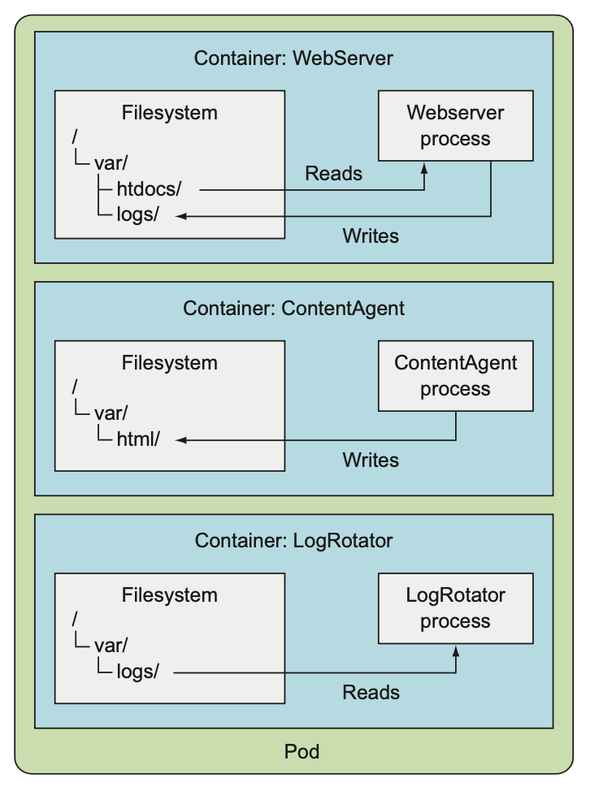
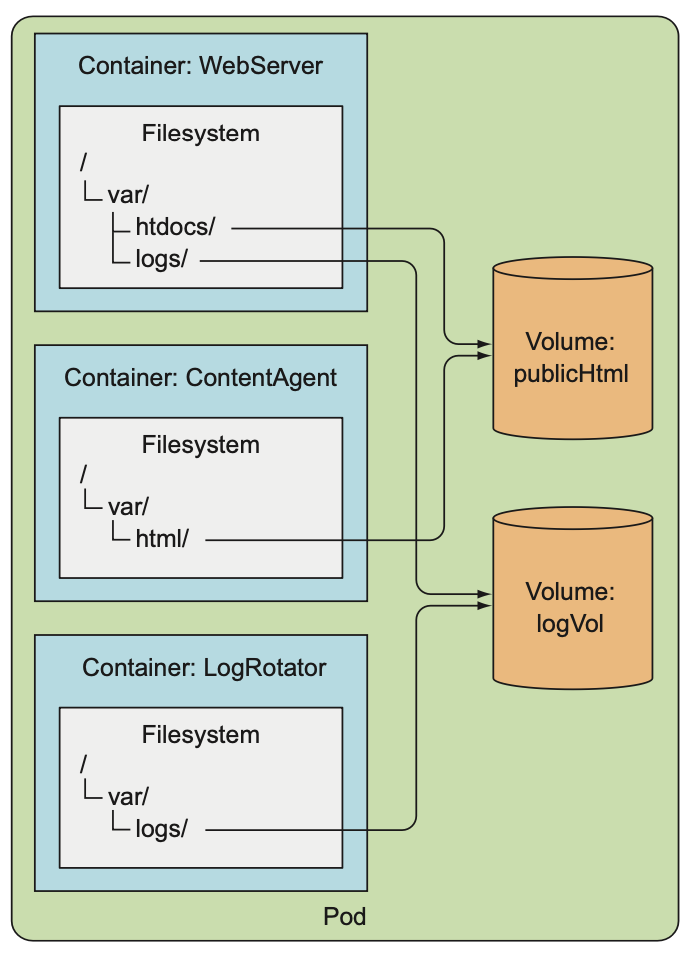

# 볼륨: 컨테이너에 디스크 스토리지 연결
쿠버네티스 볼륨은 파드의 구성 요소로 컨테이너와 동일하게 파드 스펙에서 정의된다. 볼륨은 파드의 모든 컨테이너에서 사용 가능하지만 접근하려는 컨테이너에서 각각 마운트 돼야 한다. 각 컨테이너에서 파일시스템의 어느 경로에나 볼륨을 마운트할 수 있다.

- /var/htdocs, /var/logs 에 마운트된 컨테이너 WebServer
- /var/html 에 마운트된 컨테이너 ContentAgent
- /var/logs에 마운트된 컨테이너 LogRotator

위와 같이 각각의 컨테이너에서 파일시스템에 잘 마운트된 것처럼 보이지만 사실은 의미가 없다.
- ContentAgent가 HTML 파일을 /var/html에 생성하지만 WebServer 컨테이너에서 해당 파일에 접근할 수 없기 때문에 /var/logs에 아무런 로그가 쌓이지 않으며,
- LogRotator 컨테이너는 /var/logs에 아무런 파일이 생성되지 않기 때문에 어떠한 행동도 하지 않는다.

- 앞선 그림과 마운트된 경로는 동일하지만, 해당 경로의 마운트된 디렉토리는 2개의 볼륨에 마운트되어 있다.
- publicHTML 볼륨에 /var/htdocs, /var/html
- logVol 볼륨에 /var/logs
- 이렇게 하면 ContentAgent 컨테이너가 생성한 HTML 파일을 WebServer 컨테이너가 접근해 서비스할 수 있고,
- /var/logs에 로그가 생성되면서 LogRotator 컨테이너 또한 작업이 가능하다.

## 볼륨 유형
- emptyDir: 일시적인 데이터를 저장하는데 사용되는 간단한 빈 디렉토리
- hostPath: 워커 노드의 파일시스템을 파드의 디렉토리로 마운트하는데 사용
- gitRepo: 깃 리포지토리의 콘텐츠를 체크아웃해 초기화한 볼륨
- nfs: NFS(Network File System) 공유를 파드에 마운트
- gcePersistentDisk, awsElasticBlockStore, azureDisk:  클라우드 제공자의 전용 스토리지를 마운트하는데 사용
- cindercephfs, iscsi, flocker, glusterfs, quobyte, rbd, flexVolume, vsphere Volume, photonPersistentDisk，scalelO: 다른 유형의 네트워크 스토리지를 마운트하는데 사용
- configMap, secret, downwardAPI: 쿠버네티스 리소스나 클러스터 정보를 파드에 노출하는데 사용되는 특별한 유형의 볼륨
- persistentVolumeClaim: 사전에 혹은 동적으로 프로비저닝된 퍼시스턴트 스토리지를 사용하는 방법

